# D2Station V4

## D2K5 Space Station 13 Codebase (based on rev4407)

Public source code for the popular (previously leaked) D2K5 Space Station 13 server D2Station, which operated from 2009 until 2013\. D2Station was a semi-serious roleplay server with hilarious controversial features (think hellMOO).

**Features:**

*   Full API system for XenForo, which allows you to use bdBank and Trophies as the banking and achievement system in-game. This also allowed server and character statistics to be stored on the website.
*   Currency and banking system with a fully simulated economy and inflation.
*   [Shop/market](https://github.com/unendingPattern/xenforo-mods) integration which allowed users to choose which currency to buy items with.
*   Advanced atmospheric airflow and pressure systems (thanks to Baystation 12 for the original code, thanks to Emyylii for the modifications).
*   Reagent atmospherics WIP.
*   Reagent temperatures, heating/cooling, hotplates, expiring food if not kept cold, improved cooking.
*   Early gibbed/goonstation style map and features.
*   Dismemberment and synthetic limbs (thanks Xerif).
*   Advanced weapons and weapon construction system (thanks Nori/ChairChair).
*   50+ new chemicals, foods and drinks.
*   Nicer looking UI and tweaks.
*   Added various new sound effects and changed sound effects for existing things. Also added more ambience.
*   Ability to respawn during extended rounds using in-game currency.
*   Text-to-speech while wearing spacesuit helmets (moonbase alpha style).
*   Ability to use cigarettes as a reagent container, allowing you to smoke any chemical.
*   Segways and other forms of transport.
*   Improved lighting system.
*   Improved virology and science/research.
*   Examining items/characters by clicking from a distance.
*   Large amount of new hairstyles and clothing items.
*   Ability to climb over certain objects.
*   Emotes/actions in character right-click menu
*   Improved health, atmos and power calculations.
*   Large amounts of optimizations to the master controller and code in general.
*   Improved reagent mixing system.
*   New scanner interfaces which display full body damage and information.

**Credits:**

*   Emyylii - Reagent and atmospherics improvements, various code and master controller improvements, mapping.
*   Nori/ChairChair - Reagent atmospherics, reagent temperatures, advanced weaponry and weapon construction, mapping.
*   Xerif - Dismemberment system.
*   Contributors: Soyuz (LordSlowpoke), Nernums, honeynutpenis, various others (if I forgot you, please contact me to be added!)
*   goonstation - Original rev4407 source code.
*   /tg/station13 - Various features which were ported.
*   Baystation12 - Atmospherics, various other features.

**Download:** [Latest Release](https://github.com/unendingPattern/d2station-v4-codeonly/releases)

This source code is extremely out of date and unstable, it contains many server and game breaking exploits.

<a href="screenshots/1.png" target="_blank">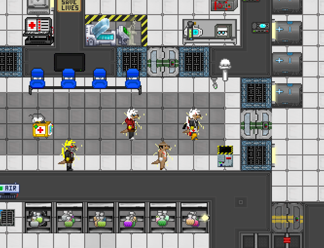</a>  <a href="screenshots/2.png" target="_blank">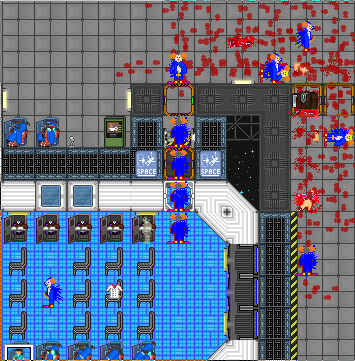</a>  <a href="screenshots/3.png" target="_blank">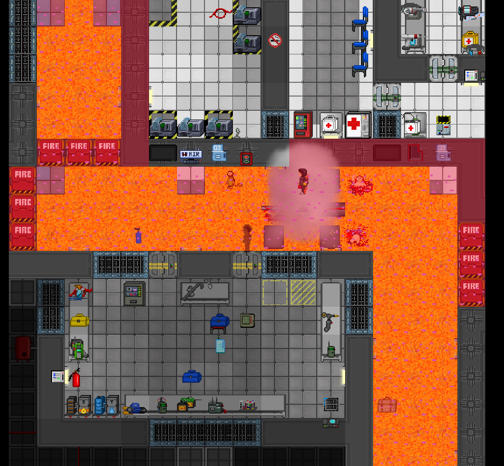</a>  <a href="screenshots/4.png" target="_blank">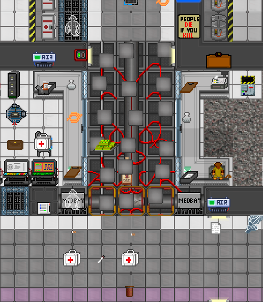</a>  <a href="screenshots/5.png" target="_blank">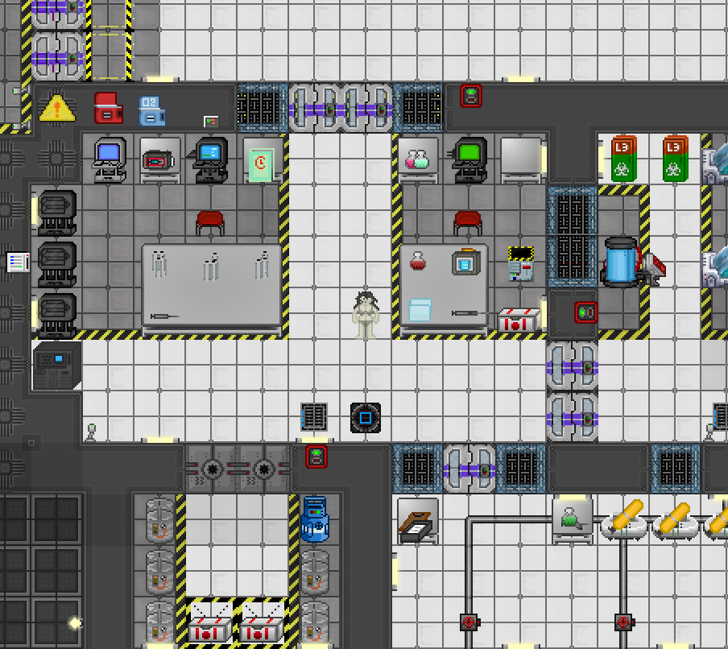</a>  <a href="screenshots/6.png" target="_blank">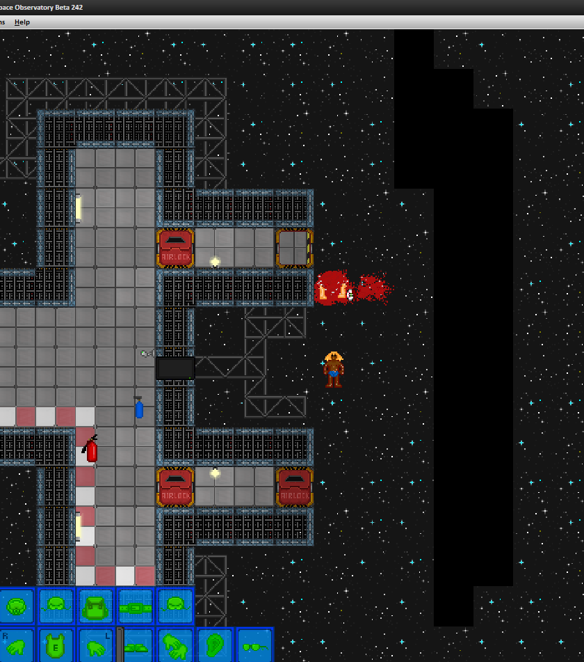</a>  <a href="screenshots/7.png" target="_blank">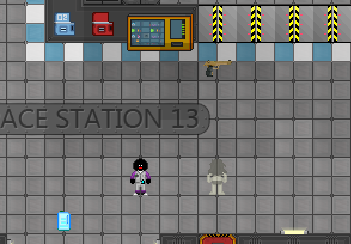</a>  <a href="screenshots/8.png" target="_blank">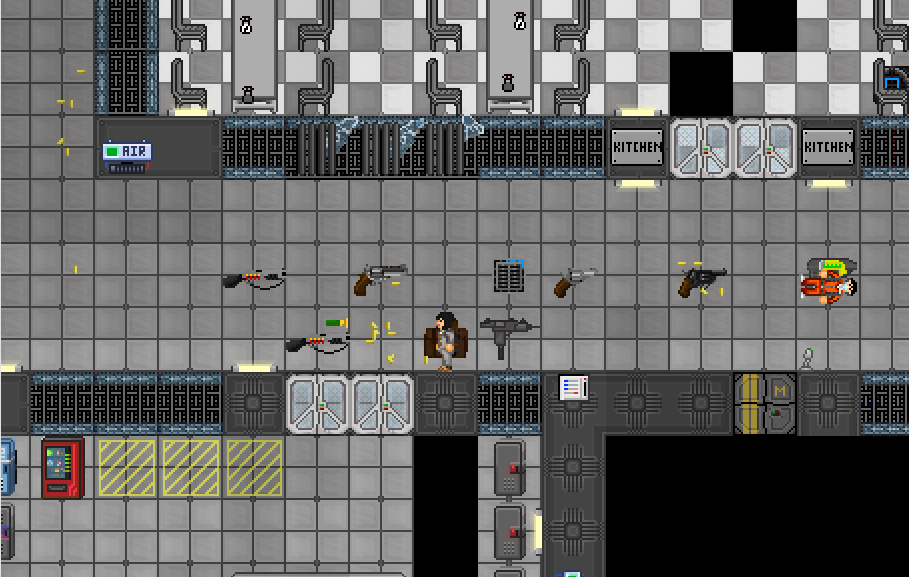</a>  <a href="screenshots/9.png" target="_blank">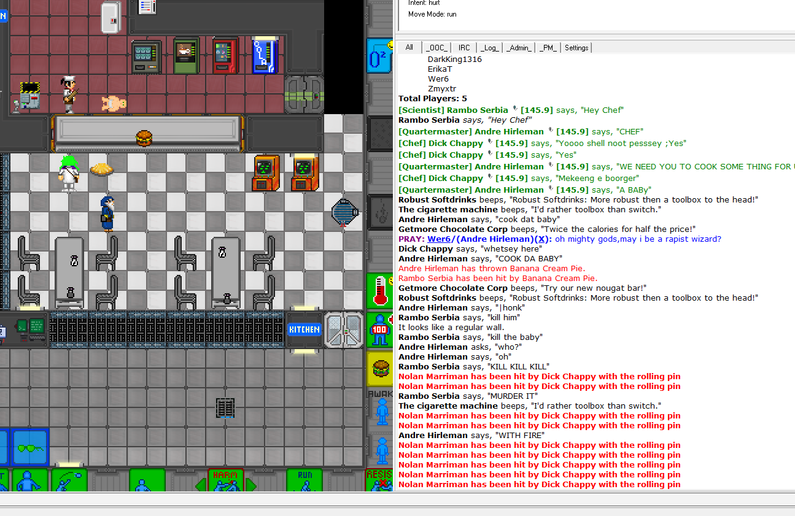</a>  <a href="screenshots/10.png" target="_blank">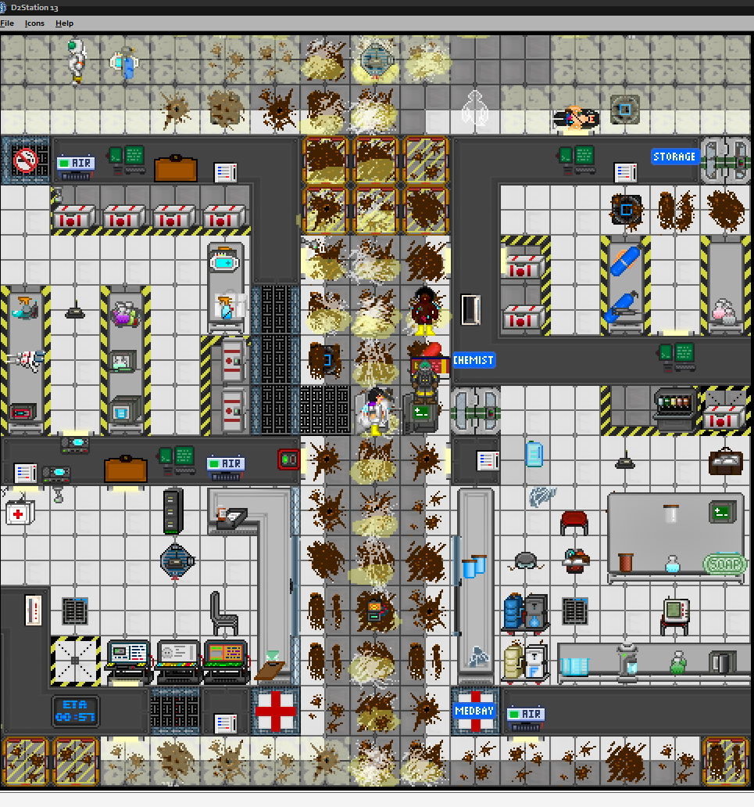</a>  <a href="screenshots/11.png" target="_blank">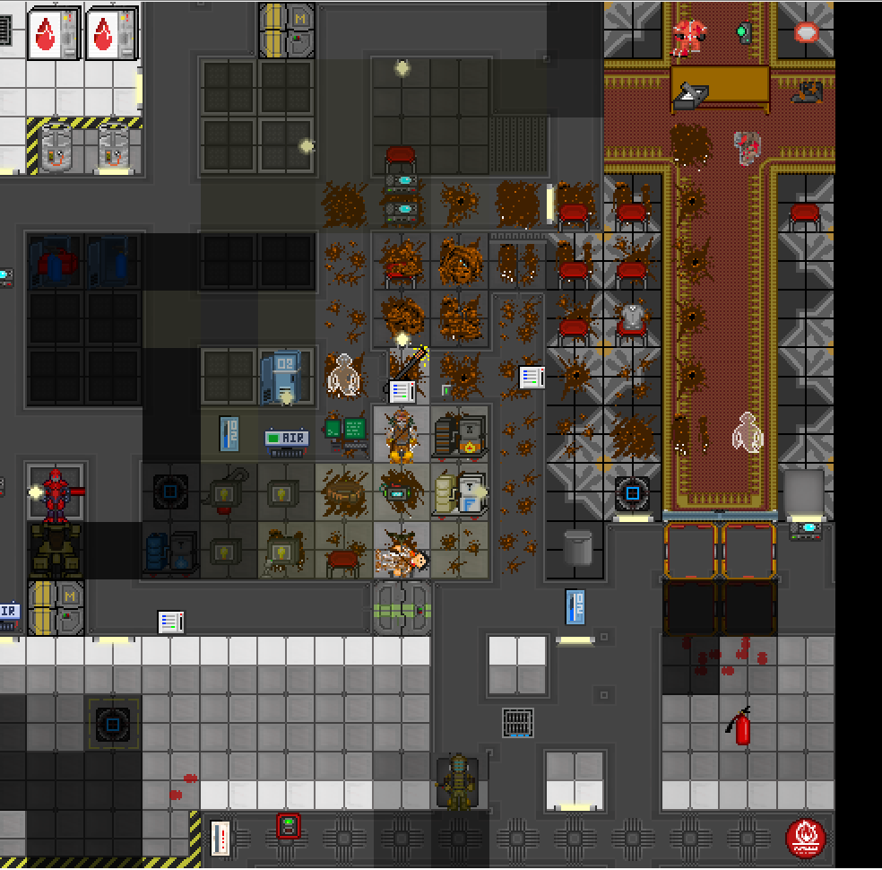</a>    <a href="screenshots/13.png" target="_blank">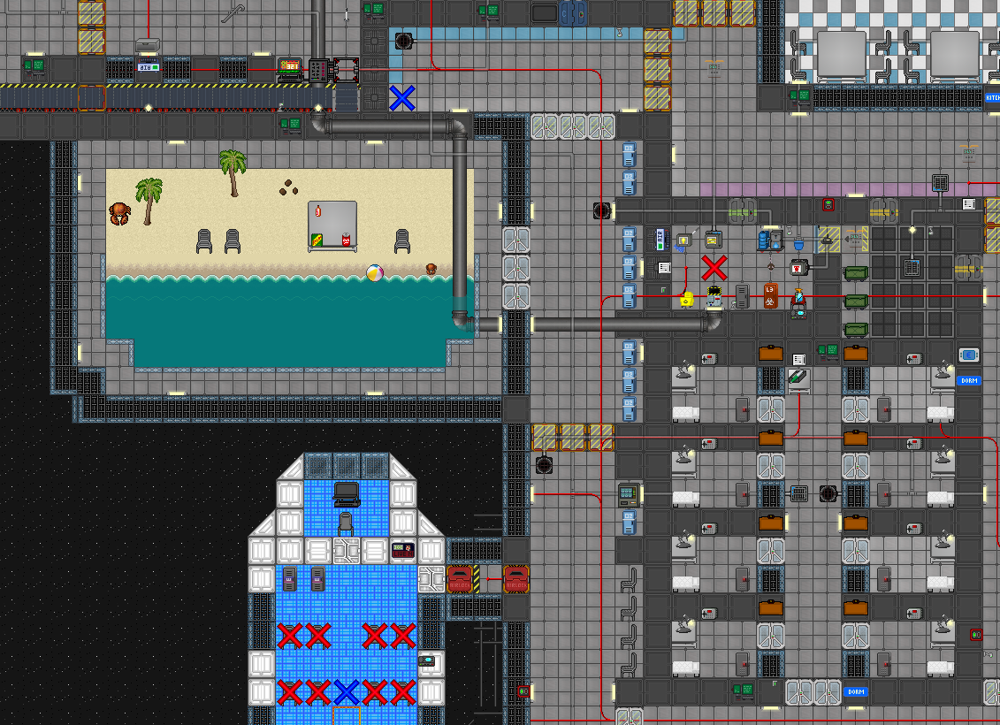</a>  <a href="screenshots/14.png" target="_blank">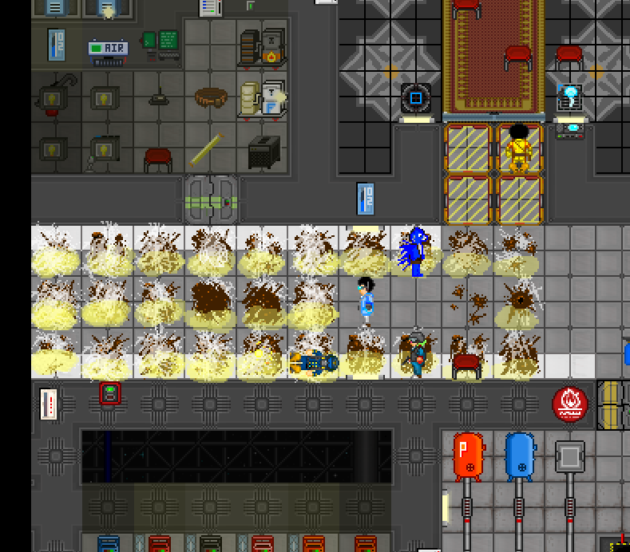</a>

Licensed under [http://creativecommons.org/licenses/by-nc-sa/3.0/](Creative Commons Attribution-Noncommercial-Share Alike 3.0).
